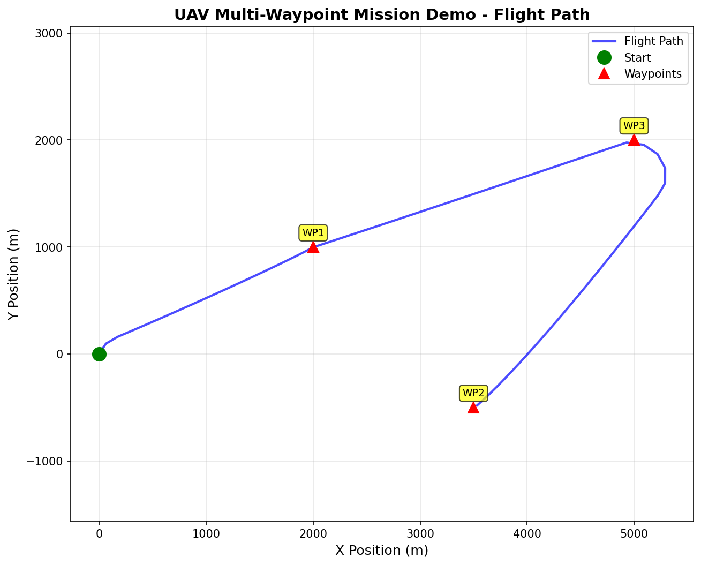
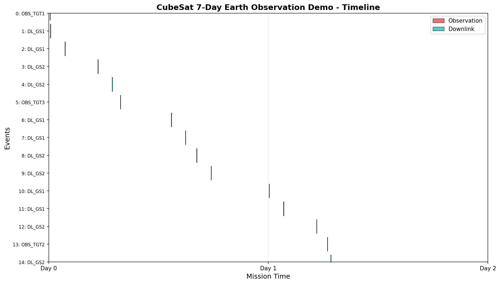
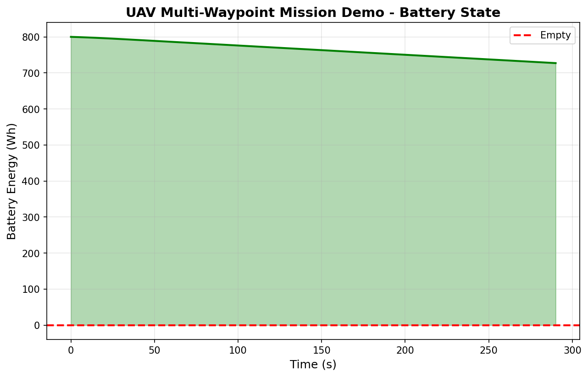
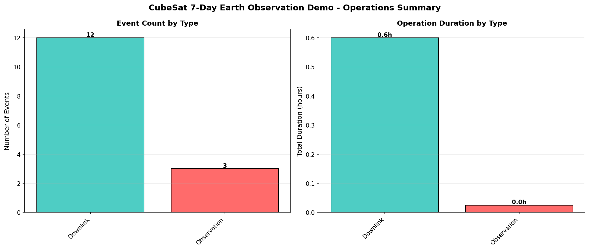

# ORBITAL

[](https://github.com/rebeccashill/ORBITAL/actions/workflows/ci.yml)

**Operational Reusable Backend for Integrated Trajectory and Logistics**  
Unified Mission Planning Framework for Aircraft and Spacecraft

Current release: `v1.0.2`

ORBITAL is a domain-agnostic mission planning framework that supports:

- Aircraft multi-waypoint optimization
- Spacecraft 7-day scheduling and operations planning
- Simulation-based optimization with constraints
- Monte Carlo robustness analysis
- Structured reporting with JSON and CSV exports
- Automated visualization for flight paths, timelines, and performance plots

---

## Quick Start

### 1. Install

```bash
git clone https://github.com/rebeccashill/ORBITAL.git
cd ORBITAL
python -m venv .venv
source .venv/bin/activate          # macOS/Linux
.venv\Scripts\Activate.ps1         # Windows PowerShell
python -m pip install --upgrade pip
python -m pip install -e ".[dev]"
```

### 2. Run Both Domains

```bash
python run_all.py --fast --no-plots
```

For full plots and default robustness settings:

```bash
python run_all.py
```

Outputs are saved to:

```text
runs/aircraft_uav_demo/
runs/cubesat_leo_demo/
```

### 3. Validate Scenario YAML

```bash
orbital validate examples/aircraft_uav_demo.yaml
orbital validate examples/cubesat_leo_demo.yaml
```

Module form:

```bash
python -m mission_framework.cli validate examples/aircraft_uav_demo.yaml
```

See [Scenario Authoring Guide](docs/SCENARIO_AUTHORING.md) for YAML structure, units, examples, and common validation errors.

### 4. Optional Individual Demo Commands

Aircraft:

```bash
orbital examples/aircraft_uav_demo.yaml --iterations 200 --restarts 1 --robustness 20 --seed 0
```

Spacecraft:

```bash
orbital examples/cubesat_leo_demo.yaml --iterations 200 --restarts 1 --robustness 10 --seed 0
```

Use `--no-plots` when you only want JSON/CSV artifacts:

```bash
python run_all.py --fast --no-plots
```

The documented CLI flags use standard double dashes, such as `--seed` and
`--iterations`. The main run command also accepts single-dash compatibility
aliases such as `-seed`, `-iterations`, `-restarts`, `-robustness`, `-outdir`,
and `-no-plots`.

---

## Example Outputs

| Aircraft flight path | Spacecraft mission timeline |
| --- | --- |
|  |  |

| Aircraft battery state | Spacecraft operations summary |
| --- | --- |
|  |  |

---

## Project Artifacts

- Release notes: `docs/RELEASE_NOTES.md`
- Technical report artifacts: `docs/`
- Results bundle: `outputs/`
- Reproducible outputs: `runs/` after executing `python run_all.py`

---

## Architecture Overview

```text
mission_framework/
  core/            Shared decision variables, constraints, objectives, planner
  simulation/      Feasibility, metrics, uncertainty utilities
  aircraft/        UAV mission model, dynamics, energy, wind, geofence checks
  spacecraft/      CubeSat orbit, visibility, attitude, power, scheduling
  reporting/       CSV and text output helpers
  visualization/   Aircraft and spacecraft plots
examples/          Demo YAML scenarios
tests/             Architecture, frame, and end-to-end tests
```

ORBITAL separates four concerns:

- Decision space: continuous, integer, binary, discrete, and permutation variables
- Simulation: aircraft dynamics, orbit propagation, battery models, and slew feasibility
- Constraints: hard constraints for feasibility and soft constraints for penalties
- Objective: minimize time/energy or maximize science value in a unified score space

---

## Baseline Comparisons

```bash
python scripts/run_baselines.py --aircraft examples/aircraft_uav_demo.yaml --spacecraft examples/cubesat_leo_demo.yaml
```

Outputs:

```text
outputs/validation/baselines/
```

The report compares ORBITAL against `random_search`, `greedy_routing`, and
`earliest_deadline` baselines across score, feasibility, runtime, and robustness.
See `docs/BASELINE_COMPARISONS.md` for the current summarized results.

---

## Stress Tests

```bash
python scripts/run_validation.py
```

Outputs:

```text
outputs/validation/
```

Failure cases are preserved for review.

---

## Multi-Seed Stability

```bash
python experiments/run_seed_experiments.py --aircraft examples/aircraft_uav_demo.yaml --spacecraft examples/cubesat_leo_demo.yaml --seeds 20 --iterations 200 --restarts 1 --robustness 0 --out results/seed_runs.csv
```

---

## Expected Runtime

- Aircraft demo: about 30-60 seconds
- Spacecraft demo: about 60-120 seconds
- Full validation suite: about 10-15 minutes

---

## Development Checks

```bash
python -m ruff check .
python -m black --check .
python -m mypy --python-version 3.12 mission_framework
python -m pytest
python -m pytest --cov=mission_framework --cov-report=term-missing
python run_all.py --fast --no-plots
```

---

## License

MIT License  
Copyright (c) 2026 Rebecca Shillingford
