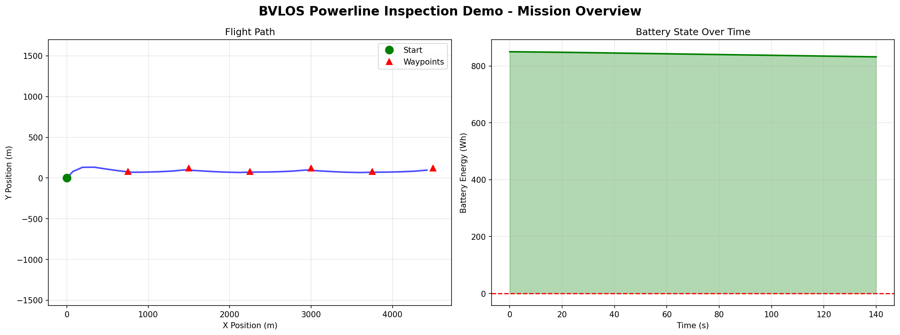

# ORBITAL

[](https://github.com/rebeccashill/ORBITAL/actions/workflows/ci.yml)

**Operational Reusable Backend for Integrated Trajectory and Logistics**  
Constraint-Aware BVLOS Inspection Mission Planning

Current release: `v1.0.10`

ORBITAL helps drone operators plan constraint-aware BVLOS inspection missions
under battery, weather, geofence, and regulatory constraints. It is built on a
domain-agnostic mission planning engine that can simulate candidate plans,
evaluate hard and soft constraints, compare objective tradeoffs, and export
auditable planning evidence before a crew commits field time.

Current v1.0.10 focus: make ORBITAL's BVLOS evidence workflow faster to scan,
clearer to demo, and more operator-friendly before customer-discovery and
Foundry-readiness work.

ORBITAL supports:

- Drone and aircraft multi-waypoint optimization
- Battery, wind, geofence, and route feasibility checks
- Primary constraint-audit reports with pass / warning / fail groups,
  operator-facing explanations, and recommended actions
- Spacecraft 7-day scheduling and operations planning as technical depth
- Simulation-based optimization with constraints
- Monte Carlo robustness analysis
- Structured reporting with JSON and CSV exports
- Automated visualization for flight paths, timelines, and performance plots

---

## Product Focus

The first customer wedge is BVLOS inspection planning for operators who need to
know whether a mission is feasible before sending a crew into the field.

Representative use cases:

- Power line and utility corridor inspection
- Pipeline and rail corridor inspection
- Solar, wind, mining, and industrial-site inspection
- Emergency infrastructure assessment after storms or outages

One-liner:

> ORBITAL helps drone inspection teams know whether a BVLOS mission is feasible
> before sending a crew into the field.

## Competitive Positioning

Drone operators already have tools for airspace authorization, fleet management,
mapping, photogrammetry, and flight execution. ORBITAL is positioned differently:
it is a preflight feasibility and evidence layer. The goal is to show the
operator which constraints are binding, whether the plan is likely to complete,
and what tradeoffs are available before the mission is attempted.

See [Differentiation](docs/DIFFERENTIATION.md) for the full positioning story,
comparison table, and product-category boundary. See
[Market Proof](docs/MARKET_PROOF.md) for the inspection-operator problem
statement, buyer and user assumptions, target customer profiles, and top
alternatives.

For a presenter-ready BVLOS walkthrough, see the
[BVLOS powerline demo script](docs/BVLOS_POWERLINE_DEMO_SCRIPT.md). The live
operator review starts with
`outputs/bvlos_powerline_inspection/operator_evidence_bundle/operator_dashboard.md`.
For a committed screenshot gallery, see the
[BVLOS demo screenshot set](docs/BVLOS_DEMO_SCREENSHOT_SET.md).
The constraint-audit report remains the primary feasibility artifact: it
translates modeled battery, weather, geofence, route-completion, and
turn-feasibility constraints into operator-readable status, impact, and
recommended action.

ORBITAL's current differentiators are:

- Constraint-first planning rather than map-first planning
- Transparent score and feasibility breakdowns
- Battery, wind, geofence, and route-completion evidence
- Monte Carlo robustness checks for uncertain mission conditions
- Exportable JSON/CSV artifacts for operator review and audit trails
- Regulatory readiness reports that document LAANC, waiver/authorization,
  airspace, visual observer, ground-risk, authorization evidence, assumptions,
  and unresolved items without implying legal approval
- Operator approval checklists that keep final confirmations with the pilot-in-
  command and operator
- Evidence bundle manifests that surface regulatory metadata, approval
  checklist status, and missing documentation-only evidence fields for operator
  review without treating them as approvals
- Evidence bundle summaries, artifact indexes, completeness scores, review
  status, and SHA-256 checksum manifests for operator audit packages

## What ORBITAL Is Not

ORBITAL is not a drone autopilot, LAANC provider, live UTM service, or regulatory
approval system. It does not replace a licensed remote pilot, operational safety
review, waiver, authorization, or customer-specific compliance process. ORBITAL
recommends and documents candidate plans; human operators remain responsible for
flight approval and execution.

The spacecraft module remains part of the repository as a demonstration of the
same planning architecture applied to a harder scheduling domain. For the current
venture story, spacecraft planning should be treated as technical depth and
future expansion rather than the initial market wedge.

---

## Quick Start

### 1. Install

```bash
git clone https://github.com/rebeccashill/ORBITAL.git
cd ORBITAL
python -m venv .venv
source .venv/bin/activate          # macOS/Linux
.venv\Scripts\Activate.ps1         # Windows PowerShell
python -m pip install --upgrade pip
python -m pip install -e ".[dev]"
```

### 2. Run Both Domains

```bash
python run_all.py --fast --no-plots
```

For full plots and default robustness settings:

```bash
python run_all.py
```

Outputs are saved to:

```text
runs/aircraft_uav_demo/
runs/cubesat_leo_demo/
```

### 3. Validate Scenario YAML

```bash
orbital validate examples/aircraft_uav_demo.yaml
orbital validate examples/cubesat_leo_demo.yaml
```

Module form:

```bash
python -m mission_framework.cli validate examples/aircraft_uav_demo.yaml
```

See [Scenario Authoring Guide](docs/SCENARIO_AUTHORING.md) for YAML structure, units, examples, and common validation errors.

### 4. Optional Individual Demo Commands

Aircraft:

```bash
orbital examples/aircraft_uav_demo.yaml --iterations 200 --restarts 1 --robustness 20 --seed 0
```

Spacecraft:

```bash
orbital examples/cubesat_leo_demo.yaml --iterations 200 --restarts 1 --robustness 10 --seed 0
```

Use `--no-plots` when you only want JSON/CSV artifacts:

```bash
python run_all.py --fast --no-plots
```

The documented CLI flags use standard double dashes, such as `--seed` and
`--iterations`. The main run command also accepts single-dash compatibility
aliases such as `-seed`, `-iterations`, `-restarts`, `-robustness`, `-outdir`,
and `-no-plots`.

---

## Example Outputs

### BVLOS Powerline Demo Snapshot

The BVLOS demo leads with feasibility and evidence, not just a map:

```text
10-second mission read
Status: GO
Mission risk: LOW
Top limiting constraint: Wind / weather margin, PASS with margin 3.1 m/s
Model transparency: assumptions, margin sources, top-limiter rationale, and reproducibility
Open first artifact: operator_evidence_bundle/operator_dashboard.md
Evidence bundle completeness: 100.0 %
Regulatory readiness: OPERATOR_ACTION_REQUIRED, documentation-only
```



See the [BVLOS powerline demo script](docs/BVLOS_POWERLINE_DEMO_SCRIPT.md) for
the baseline feasibility, limiting constraint, what-if comparison, regulatory
readiness, and evidence bundle walkthrough. See the
[BVLOS demo screenshot set](docs/BVLOS_DEMO_SCREENSHOT_SET.md) for captured
dashboard, audit, what-if, regulatory, index, and plot visuals with captions.

Evidence bundle quick checks do not rerun optimization:

```bash
python -m mission_framework.cli open-first outputs/bvlos_powerline_inspection/operator_evidence_bundle
python -m mission_framework.cli verdict outputs/bvlos_powerline_inspection/operator_evidence_bundle
python -m mission_framework.cli top outputs/bvlos_powerline_inspection/operator_evidence_bundle
python -m mission_framework.cli bundle-summary outputs/bvlos_powerline_inspection/operator_evidence_bundle
python -m mission_framework.cli bundle-verify outputs/bvlos_powerline_inspection/operator_evidence_bundle
python -m mission_framework.cli bundle-top outputs/bvlos_powerline_inspection/operator_evidence_bundle
python -m mission_framework.cli bundle-review-validate outputs/bvlos_powerline_inspection/operator_evidence_bundle
```

The short commands mirror the dashboard language: `open-first` prints the first
artifact to open, `verdict` prints the mission verdict and next operator action,
and `top` prints the top limiting constraint with the recommended operator
action.

### Standard Domain Outputs

| Aircraft flight path | Spacecraft mission timeline |
| --- | --- |
|  |  |

| Aircraft battery state | Spacecraft operations summary |
| --- | --- |
|  |  |

---

## Project Artifacts

- Release notes: `docs/RELEASE_NOTES.md`
- Differentiation story: `docs/DIFFERENTIATION.md`
- Market proof: `docs/MARKET_PROOF.md`
- BVLOS demo narrative: `docs/BVLOS_POWERLINE_DEMO_SCRIPT.md`
- Primary BVLOS demo audit:
  `outputs/bvlos_powerline_inspection/inspection_constraint_audit.md`
  (includes model assumptions, margin units/sources, top-limiter rationale,
  reproducibility, and model limitations)
- BVLOS operator dashboard:
  `outputs/bvlos_powerline_inspection/operator_evidence_bundle/operator_dashboard.md`
- BVLOS evidence bundle summary:
  `outputs/bvlos_powerline_inspection/operator_evidence_bundle/evidence_bundle_summary.md`
- BVLOS demo screenshot set: `docs/BVLOS_DEMO_SCREENSHOT_SET.md`
- Technical report artifacts: `docs/`
- Results bundle: `outputs/`
- Reproducible outputs: `runs/` after executing `python run_all.py`

---

## Architecture Overview

```text
mission_framework/
  core/            Shared decision variables, constraints, objectives, planner
  simulation/      Feasibility, metrics, uncertainty utilities
  aircraft/        UAV mission model, dynamics, energy, wind, geofence checks
  spacecraft/      CubeSat orbit, visibility, attitude, power, scheduling
  reporting/       CSV and text output helpers
  visualization/   Aircraft and spacecraft plots
examples/          Demo YAML scenarios
tests/             Architecture, frame, and end-to-end tests
```

ORBITAL separates four concerns:

- Decision space: continuous, integer, binary, discrete, and permutation variables
- Simulation: aircraft dynamics, orbit propagation, battery models, and slew feasibility
- Constraints: hard constraints for feasibility and soft constraints for penalties
- Objective: minimize time/energy or maximize science value in a unified score space

---

## Baseline Comparisons

```bash
python scripts/run_baselines.py --aircraft examples/aircraft_uav_demo.yaml --spacecraft examples/cubesat_leo_demo.yaml
```

Outputs:

```text
outputs/validation/baselines/
```

The report compares ORBITAL against `random_search`, `greedy_routing`, and
`earliest_deadline` baselines across score, feasibility, runtime, and robustness.
The current spacecraft demo is intentionally easy, so all spacecraft planners can
tie on full science value; see `docs/BASELINE_COMPARISONS.md` for benchmark scope
and current summarized results.

## Optimizer Maturity

```bash
python scripts/run_optimizer_maturity.py --out outputs/validation/optimizer_maturity/optimizer_maturity.csv --orbital-iterations 120 --orbital-restarts 1 --random-samples 25 --robustness-cases 3 --speed-grid 5 --offset-grid 3 --max-exhaustive-candidates 5000 --seed 0
```

Outputs:

```text
outputs/validation/optimizer_maturity/
```

This broader report adds stress scenarios and an `exhaustive_grid` solver-style
comparison where small decision spaces make enumeration practical. ORBITAL's
optimizer is strong demo and research engineering, but not yet production-grade
mission planning; see `docs/OPTIMIZER_MATURITY.md`.

---

## Stress Tests

```bash
python scripts/run_validation.py
```

Outputs:

```text
outputs/validation/
```

Failure cases are preserved for review.

---

## Multi-Seed Stability

```bash
python experiments/run_seed_experiments.py --aircraft examples/aircraft_uav_demo.yaml --spacecraft examples/cubesat_leo_demo.yaml --seeds 20 --iterations 200 --restarts 1 --robustness 0 --out results/seed_runs.csv
```

---

## Expected Runtime

- Aircraft demo: about 30-60 seconds
- Spacecraft demo: about 60-120 seconds
- Full validation suite: about 10-15 minutes

---

## Development Checks

```bash
python -m ruff check .
python -m black --check .
python -m mypy --python-version 3.12 mission_framework
python -m pytest
python -m pytest --cov=mission_framework --cov-report=term-missing
python run_all.py --fast --no-plots
```

---

## License

MIT License  
Copyright (c) 2026 Rebecca Shillingford
