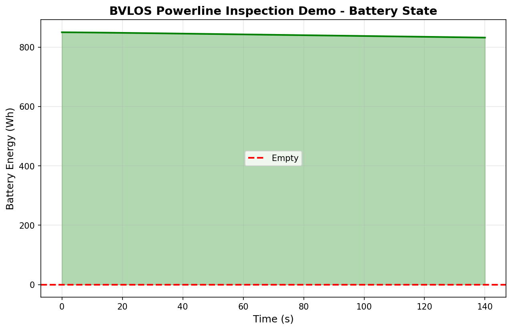

# BVLOS Demo Screenshot Set

Use this page as the capture checklist for README, demo, and Foundry-style
materials. The first image should show the operator review flow, not only the
map.

## Primary Review Screens

| Capture | Artifact | Purpose |
| --- | --- | --- |
| Operator dashboard | `outputs/bvlos_powerline_inspection/operator_evidence_bundle/operator_dashboard.md` | Shows mission status, risk, top limiting constraint, regulatory readiness, bundle completeness, and review metadata on one page. |
| Evidence summary | `outputs/bvlos_powerline_inspection/operator_evidence_bundle/evidence_bundle_summary.md` | Shows reviewer snapshot, recommended review flow, completeness, missing evidence, warnings, and documentation-only review fields. |
| Constraint audit | `outputs/bvlos_powerline_inspection/operator_evidence_bundle/inspection_constraint_audit.md` | Shows the operator handoff, pass / warning / fail constraint summary, top-limiter rationale, assumptions, and recommended actions. |
| Regulatory readiness | `outputs/bvlos_powerline_inspection/operator_evidence_bundle/regulatory_readiness_report.md` | Shows documentation-only regulatory status and unresolved operator action items. |
| Artifact index | `outputs/bvlos_powerline_inspection/operator_evidence_bundle/artifact_index.md` | Shows the recommended opening order and links to bundle artifacts. |

## Generated Visual Assets

### Mission Overview

### Flight Path

### Battery State

## Compact Demo Flow

1. Open `operator_dashboard.md` for the 10-second mission read.
2. Open `inspection_constraint_audit.md` for the top limiting constraint and
   operator action.
3. Open `what_if_plan.md` to show how alternatives improve or preserve
   feasibility.
4. Open `regulatory_readiness_report.md` to reinforce decision-support-only
   regulatory language.
5. Open `artifact_index.md`, `manifest.json`, and `checksum_manifest.json` to
   show bundle completeness and auditability.

## Caption Set

- Operator dashboard: "ORBITAL starts with a defensibility dashboard: go/no-go
  signal, mission risk, top constraint, regulatory readiness, and evidence
  completeness."
- Constraint audit: "The audit explains what ORBITAL checked, why each
  constraint matters to an operator, and what action to take."
- What-if plan: "The what-if report shows whether a mission change improves
  feasibility without hiding the underlying tradeoffs."
- Regulatory readiness: "Regulatory fields are documentation-only and do not
  grant LAANC, waivers, authorization, legal approval, or permission to fly."
- Evidence bundle: "The final bundle packages review status, artifact links,
  checksums, and machine-readable manifest metadata for audit trails."
