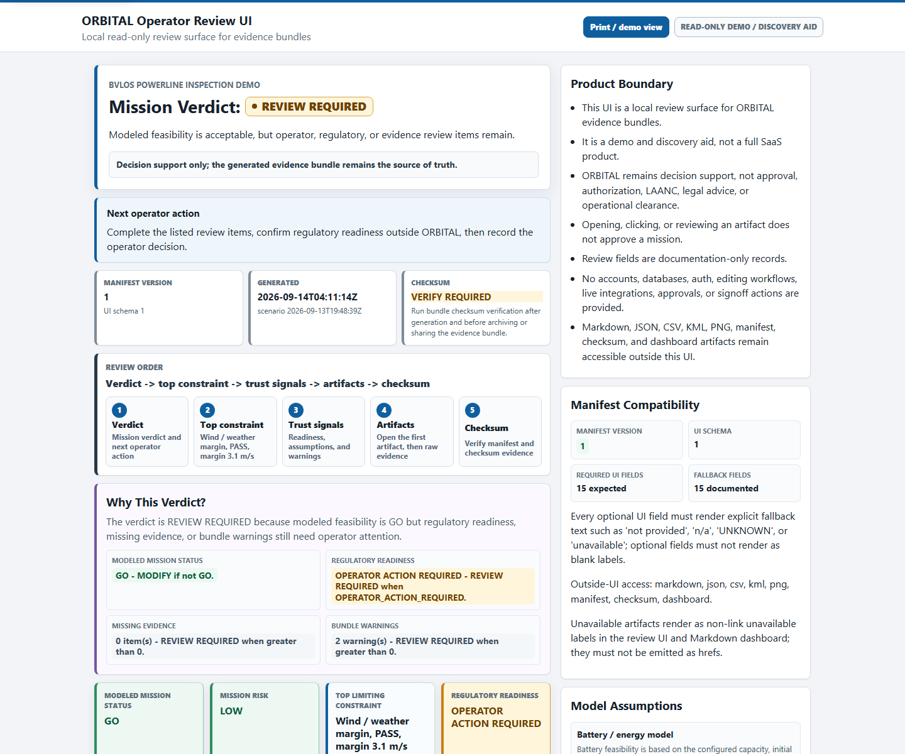
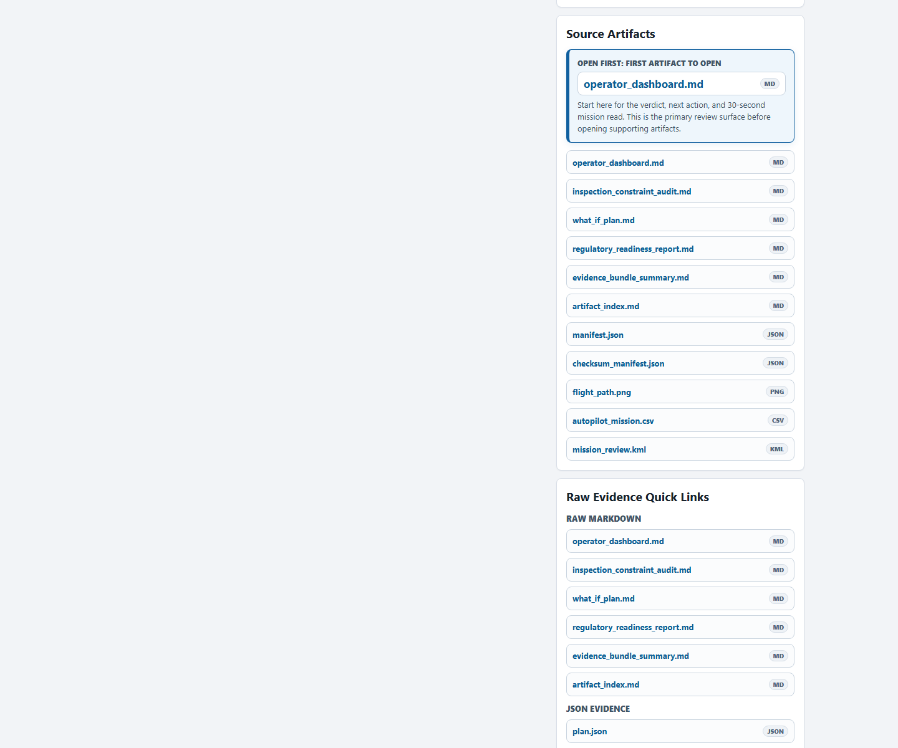
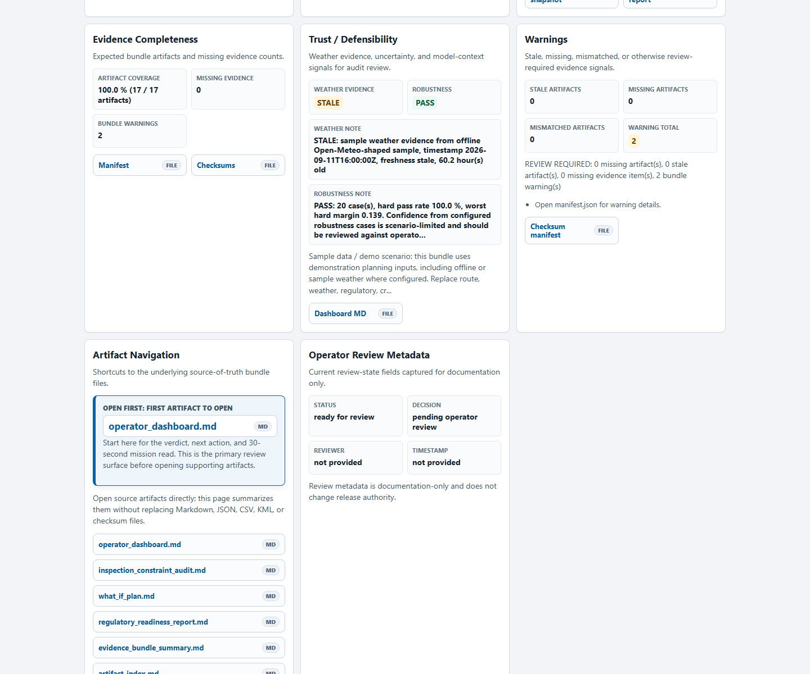
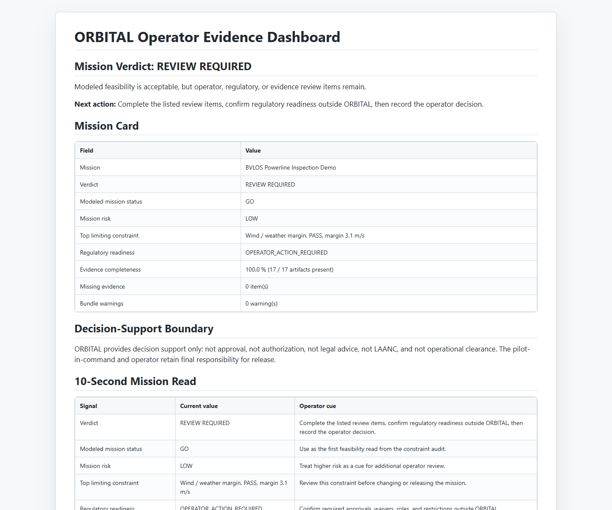
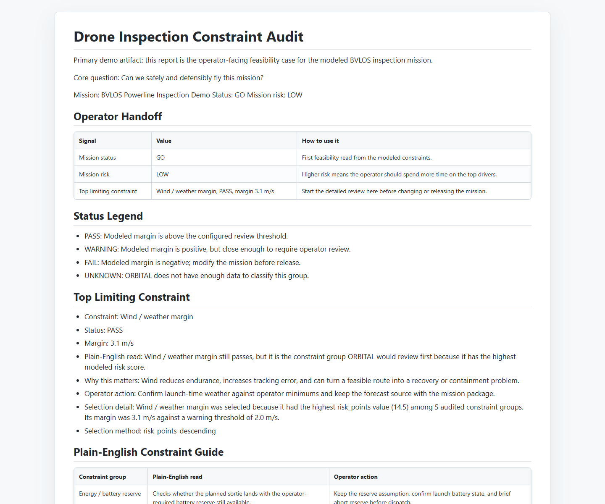
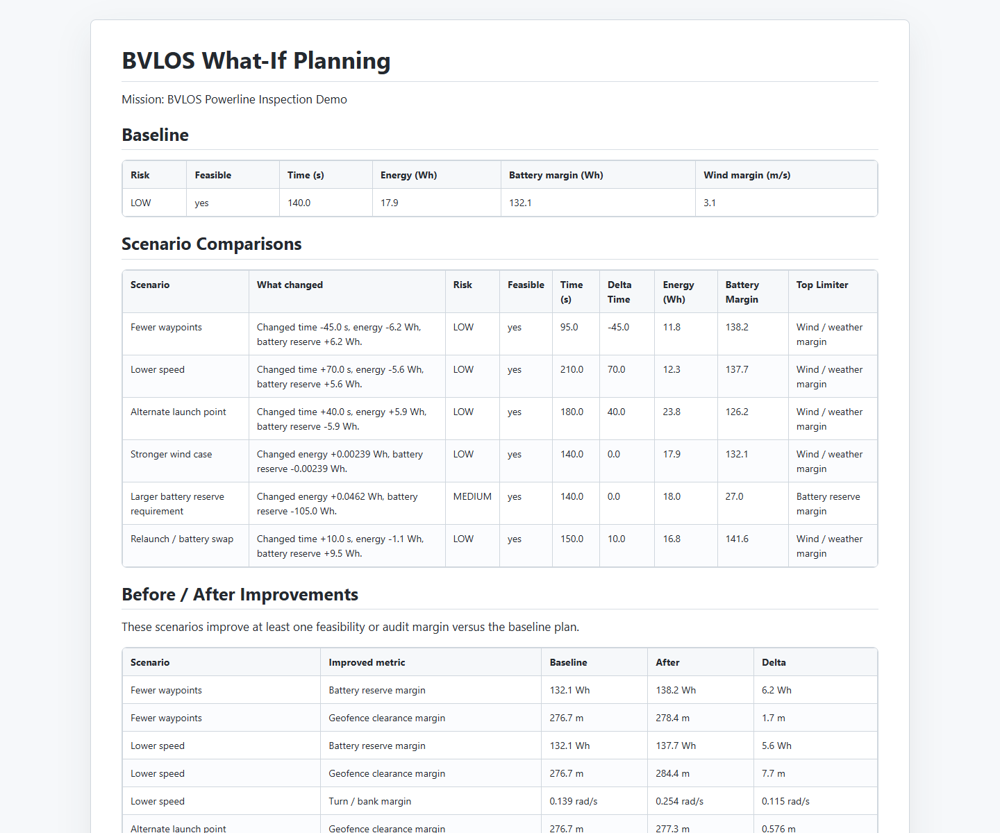
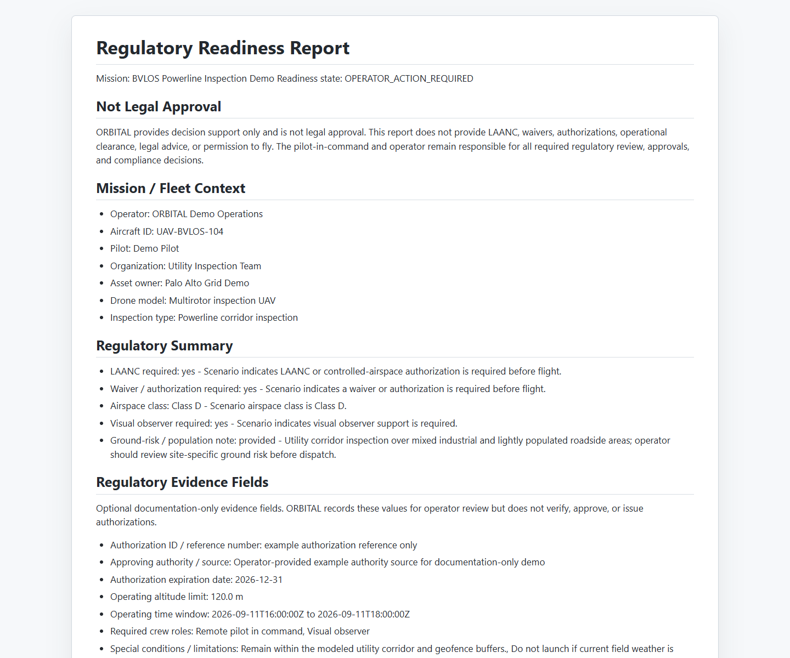
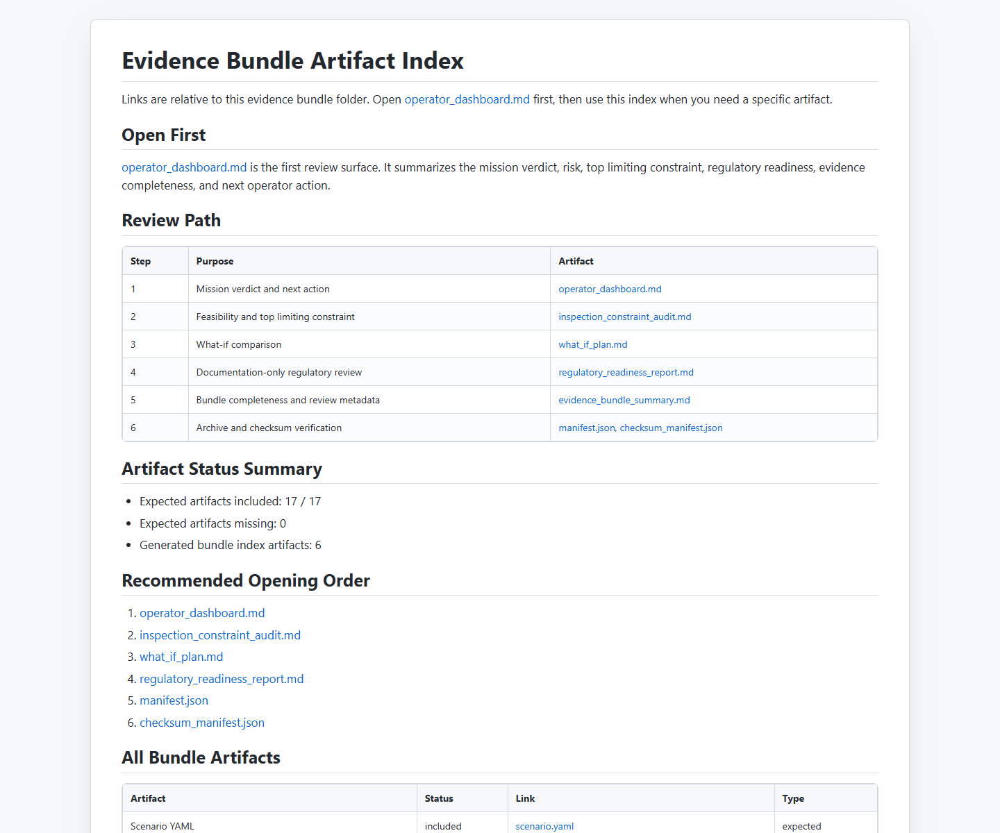
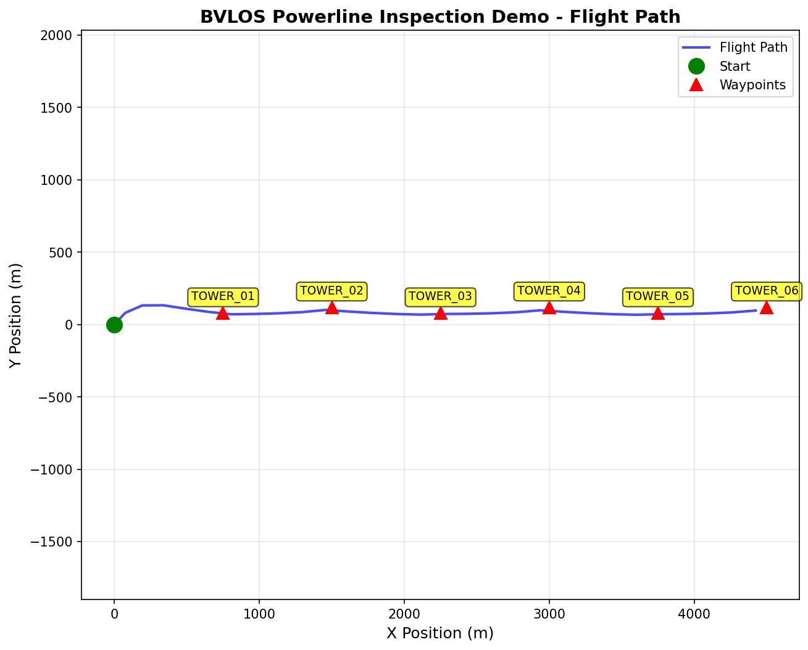

# BVLOS Demo Screenshot Set

Captured images live in `docs/assets/bvlos_screenshots/`. Use this page for
README updates, demo walkthroughs, and Foundry-style materials. The set leads
with the read-only operator review UI, then opens the Markdown evidence bundle
that remains the source of truth, and closes with the route plot.

v1.0.13 screenshot intent: prove that ORBITAL is faster to review without
weakening evidence defensibility. The screenshots should show verdict, top
constraint, trust signals, artifacts, checksum readiness, freshness, and
operator-confirmed live/regulatory boundaries.

## What Improved Since v1.0.12

- The UI now leads with a review order strip: verdict -> top constraint -> trust
  signals -> artifacts -> checksum.
- A dedicated "Why this verdict?" panel explains how modeled status,
  regulatory readiness, missing evidence, and warnings produce the review
  verdict.
- Manifest compatibility, source timestamps, artifact freshness, checksum
  readiness, and unavailable-artifact behavior are visible in the review flow.
- Weather and regulatory evidence are labeled as documentation-only unless
  verified outside ORBITAL by the operator.

## Screenshot Gallery

### Web UI Dashboard

Caption: The dashboard proves the local UI can give reviewers a 30-second
read of the generated BVLOS evidence bundle: mission verdict, why-this-verdict,
review order, top constraint, next action, manifest compatibility, checksum
readiness, weather/regulatory freshness, model assumptions, and warning counts.
It is read-only and does not approve, authorize, clear, or replace the
underlying evidence bundle.

### UI Artifact Navigation

Caption: The navigation panel proves the UI is a discovery layer over the raw
evidence bundle. It makes `operator_dashboard.md` unmistakable as the first
artifact to open and links directly to Markdown, JSON, CSV, KML, PNG, manifest,
checksum, and dashboard artifacts without hiding or mutating them. Missing or
unavailable artifacts render as unavailable text rather than broken links.

### UI Trust / Defensibility

Caption: The trust section proves the UI surfaces defensibility signals without
turning them into approval: weather evidence source, timestamp, freshness,
operator action, robustness confidence, model context, and sample-data/demo
caveats remain visible during review. Live weather and regulatory provenance
remain operator-confirmed unless verified outside ORBITAL.

### Markdown Operator Dashboard

Caption: The Markdown dashboard proves the source evidence remains accessible
outside the UI. It records the operator's mission read, review order, mission
verdict, mission risk, top limiting constraint, regulatory readiness, evidence
completeness, weather/regulatory freshness, checksum readiness, and next action
in the bundle of record.

### Constraint Audit

Caption: The audit proves the constraint workflow is an operator review
artifact, not an engineering log. It shows the top limiter, plain-English
constraint language, status legend, and recommended operator action.

### What-If Comparison

Caption: The what-if report proves ORBITAL can compare baseline feasibility
against mission changes and show what changed without hiding the tradeoffs.

### Regulatory Readiness Report

Caption: The regulatory report proves the workflow is documentation-only and
legally honest. It summarizes LAANC, waiver or authorization, airspace, visual
observer, ground-risk, authority source, date checked, expiration, operator
confirmation, and unresolved regulatory items without implying approval.

### Artifact Index

Caption: The artifact index proves the evidence bundle has a clear opening
order and links operators to the dashboard, audit, what-if plan, regulatory
report, manifest, checksum manifest, plots, CSV, and KML files while keeping
raw artifacts accessible outside the UI.

### Flight Path Plot

Caption: The flight path plot proves the bundle still includes a concrete route
visual showing the start point, waypoint sequence, and modeled flight path.

## Source Map

| Capture | Source artifact | Committed image |
| --- | --- | --- |
| Web UI dashboard | `outputs/bvlos_powerline_inspection/operator_evidence_bundle/operator_review_ui.html` | `docs/assets/bvlos_screenshots/operator_review_ui.png` |
| UI artifact navigation | `outputs/bvlos_powerline_inspection/operator_evidence_bundle/operator_review_ui.html#source-artifacts` | `docs/assets/bvlos_screenshots/operator_review_ui_artifact_navigation.png` |
| UI trust / defensibility | `outputs/bvlos_powerline_inspection/operator_evidence_bundle/operator_review_ui.html#trust-defensibility` | `docs/assets/bvlos_screenshots/operator_review_ui_trust_defensibility.png` |
| Markdown operator dashboard | `outputs/bvlos_powerline_inspection/operator_evidence_bundle/operator_dashboard.md` | `docs/assets/bvlos_screenshots/operator_dashboard.png` |
| Constraint audit | `outputs/bvlos_powerline_inspection/operator_evidence_bundle/inspection_constraint_audit.md` | `docs/assets/bvlos_screenshots/constraint_audit.png` |
| What-if comparison | `outputs/bvlos_powerline_inspection/operator_evidence_bundle/what_if_plan.md` | `docs/assets/bvlos_screenshots/what_if_comparison.png` |
| Regulatory readiness | `outputs/bvlos_powerline_inspection/operator_evidence_bundle/regulatory_readiness_report.md` | `docs/assets/bvlos_screenshots/regulatory_readiness.png` |
| Artifact index | `outputs/bvlos_powerline_inspection/operator_evidence_bundle/artifact_index.md` | `docs/assets/bvlos_screenshots/artifact_index.png` |
| Flight path plot | `outputs/bvlos_powerline_inspection/flight_path.png` | `docs/assets/bvlos_screenshots/flight_path_plot.png` |

## Compact Demo Flow

1. Run `python -m mission_framework.cli serve-ui` and open the printed
   `operator_review_ui.html` URL for the 30-second review path.
2. State the boundary: the UI is local and read-only; the Markdown, JSON, CSV,
   KML, PNG, manifest, checksum, and dashboard files remain accessible outside
   the UI.
3. Open `operator_dashboard.md` from Source Artifacts to show the bundle of
   record.
4. Open `inspection_constraint_audit.md` for the top limiting constraint and
   operator action.
5. Open `what_if_plan.md` to show how alternatives improve or preserve
   feasibility.
6. Open `regulatory_readiness_report.md` to reinforce operator-confirmed,
   decision-support-only regulatory language.
7. Open `artifact_index.md`, `manifest.json`, and `checksum_manifest.json` to
   show bundle completeness, manifest compatibility, checksum readiness, and
   auditability.
