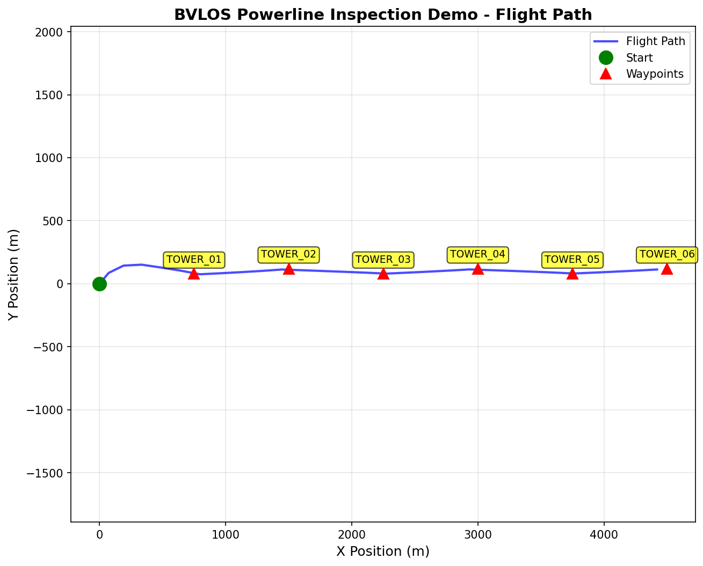

# BVLOS Powerline Inspection Demo Script

This walkthrough shows ORBITAL as a constraint-aware BVLOS inspection
feasibility and audit evidence workflow. The demo is designed around one
operator question:

> Can we safely and defensibly fly this mission?

Use this script for a customer, investor, or HBS-style product demo. It keeps
the narrative grounded in generated artifacts rather than treating ORBITAL as a
generic map or route-planning tool.

## Demo Setup

Regenerate the full demo artifacts, including plots:

```bash
python -m mission_framework.cli examples/bvlos_powerline_inspection_demo.yaml --outdir outputs
```

For a text-only refresh without PNG plots:

```bash
python -m mission_framework.cli examples/bvlos_powerline_inspection_demo.yaml --outdir outputs --no-plots
```

Primary files to open:

- `outputs/bvlos_powerline_inspection/operator_evidence_bundle/operator_dashboard.md`
- `outputs/bvlos_powerline_inspection/inspection_constraint_audit.md`
- `outputs/bvlos_powerline_inspection/what_if_plan.md`
- `outputs/bvlos_powerline_inspection/regulatory_readiness_report.md`
- `outputs/bvlos_powerline_inspection/operator_evidence_bundle/evidence_bundle_summary.md`
- `outputs/bvlos_powerline_inspection/operator_evidence_bundle/artifact_index.md`

## Demo Arc

1. Start with the operator evidence dashboard, not the map.
2. Drill into the constraint audit for baseline feasibility and top limiting constraint.
3. Show what-if alternatives and before/after improvements.
4. Show regulatory readiness as documentation-only decision support.
5. Finish with the evidence bundle summary, index, and checksum manifest.

## 0. Operator Evidence Dashboard

Open:

```text
outputs/bvlos_powerline_inspection/operator_evidence_bundle/operator_dashboard.md
```

Presenter script:

> The first artifact an operator opens is the dashboard. It pulls the mission
> status, mission risk, top limiting constraint, regulatory readiness, bundle
> completeness, review fields, and artifact links into one page. This is where
> a reviewer starts before drilling into the audit, what-if plan, regulatory
> report, manifest, checksums, plot, CSV, and KML.

Sample output:

```text
Mission status: GO
Mission risk: LOW
Top limiting constraint: Wind / weather margin, PASS, margin 3.1 m/s
Regulatory readiness: OPERATOR_ACTION_REQUIRED
Bundle completeness: 100.0 %
Operator decision: pending operator review
```

Emphasize the dashboard boundary language: it is not approval, not
authorization, not legal advice, not LAANC, and not operational clearance.

## 1. Baseline Mission Feasibility

Open:

```text
outputs/bvlos_powerline_inspection/inspection_constraint_audit.md
```

Presenter script:

> ORBITAL starts with the operator's real question: can this BVLOS inspection be
> flown safely and defensibly under the modeled constraints? For this demo, the
> baseline powerline corridor mission is a GO with LOW modeled mission risk.

Sample output:

```text
Mission: BVLOS Powerline Inspection Demo
Status: GO
Mission risk: LOW
```

Then point to the constraint group table. The important move is that ORBITAL
does not merely draw the corridor route. It translates modeled constraints into
operator-readable status, margins, operational impact, and recommended action.

Baseline constraint summary:

| Constraint group | Status | Margin |
| --- | --- | ---: |
| Energy / battery reserve | PASS | 132.1 Wh |
| Weather / wind margin | PASS | 3.1 m/s |
| Geofence / no-fly-zone clearance | PASS | 276.7 m |
| Route completion | PASS | 1.0 completion |
| Turn / bank feasibility | PASS | 0.139 rad/s |

## 2. Top Limiting Constraint

Stay in:

```text
outputs/bvlos_powerline_inspection/inspection_constraint_audit.md
```

Presenter script:

> The route is feasible, but ORBITAL still identifies the constraint most worth
> watching. In this run, the top limiting constraint is the weather margin. It
> passes, but it carries the highest risk contribution because wind can quickly
> reduce endurance, tracking quality, and recovery margin.

Sample output:

```text
Top limiting constraint: Wind / weather margin, PASS with margin 3.1 m/s
```

Use the top three risk drivers section to explain that "GO" does not mean "stop
thinking." It means the current modeled plan passes, while the operator can see
which assumptions deserve the most review before dispatch.

Then open the Model Transparency section in the same audit. It records battery,
wind, geofence, route completion, turn feasibility, and robustness assumptions;
lists margin units and sources; explains why the top limiting constraint was
selected; and captures the scenario path, seed, iterations, robustness cases,
and command used to reproduce the report. Use the limitations notes to keep the
demo legally and technically honest about offline/sample weather and simplified
flight dynamics.

CLI shortcut:

```bash
python -m mission_framework.cli bundle-top outputs/bvlos_powerline_inspection/operator_evidence_bundle
```

This prints the top limiting constraint and recommended operator action without
rerunning optimization.

## 3. What-If Comparison

Open:

```text
outputs/bvlos_powerline_inspection/what_if_plan.md
```

Presenter script:

> ORBITAL then compares realistic planning alternatives. Instead of manually
> duplicating routes and guessing which adjustment helps, the operator can see
> how changes affect feasibility, time, energy, and the top limiter.

Baseline:

```text
Risk: LOW
Feasible: yes
Time: 140.0 s
Energy: 17.9 Wh
Battery margin: 132.1 Wh
Wind margin: 3.1 m/s
```

Useful scenario callouts:

| Scenario | Risk | Feasible | Operator meaning |
| --- | --- | --- | --- |
| Fewer waypoints | LOW | yes | Shorter sortie, better battery reserve |
| Lower speed | LOW | yes | Longer time, better energy and turn margin |
| Larger battery reserve requirement | MEDIUM | yes | Feasible, but reserve policy becomes the tighter review item |
| Relaunch / battery swap | LOW | yes | Stronger battery reserve by splitting the operation |

Before/after examples:

```text
Fewer waypoints improves battery reserve from 132.1 Wh to 138.2 Wh.
Lower speed improves turn / bank margin from 0.139 rad/s to 0.254 rad/s.
Relaunch / battery swap improves battery reserve from 132.1 Wh to 141.6 Wh.
```

## 4. Regulatory Readiness

Open:

```text
outputs/bvlos_powerline_inspection/regulatory_readiness_report.md
```

Presenter script:

> ORBITAL is legally honest here: this is decision support, not approval. It
> records what the operator must confirm outside ORBITAL, including LAANC,
> waiver or authorization coverage, visual observer support, airspace class,
> ground-risk notes, and authorization evidence fields.

Sample output:

```text
Readiness state: OPERATOR_ACTION_REQUIRED
LAANC required: yes
Waiver / authorization required: yes
Airspace class: Class D
Visual observer required: yes
```

The key product boundary:

```text
ORBITAL provides decision support only and is not legal approval.
```

Then show the operator approval checklist. It includes LAANC confirmation,
waiver / authorization confirmation, visual observer assignment, crew briefing,
emergency / contingency planning, NOTAM / local restriction review, weather
minimums, and battery reserve confirmation.

## 5. Final Evidence Bundle

Open:

```text
outputs/bvlos_powerline_inspection/operator_evidence_bundle/operator_dashboard.md
outputs/bvlos_powerline_inspection/operator_evidence_bundle/evidence_bundle_summary.md
```

CLI shortcuts:

```bash
python -m mission_framework.cli open-first outputs/bvlos_powerline_inspection/operator_evidence_bundle
python -m mission_framework.cli verdict outputs/bvlos_powerline_inspection/operator_evidence_bundle
python -m mission_framework.cli top outputs/bvlos_powerline_inspection/operator_evidence_bundle
python -m mission_framework.cli bundle-summary outputs/bvlos_powerline_inspection/operator_evidence_bundle
python -m mission_framework.cli bundle-verify outputs/bvlos_powerline_inspection/operator_evidence_bundle
python -m mission_framework.cli bundle-review-validate outputs/bvlos_powerline_inspection/operator_evidence_bundle
```

Presenter script:

> The end product is an evidence package an operator can review, store, and hand
> to stakeholders. It is not just a plan. It is a bundle with the constraint
> audit, regulatory readiness report, route artifacts, weather snapshot,
> downstream planning exports, manifest, index, and checksums.

Sample output:

```text
Completeness score: 100.0 %
Artifacts present: 17 / 17
Missing artifact count: 0
Operator review status: ready for review
```

Then open:

```text
outputs/bvlos_powerline_inspection/operator_evidence_bundle/artifact_index.md
```

Use the index to show that the bundle links the scenario YAML, plan JSON,
constraint audit, regulatory report, score breakdown, flight path plot,
robustness summary, operator memo, weather snapshot, autopilot CSV, KML review
file, manifest, summary, README, and checksum manifest.

## Screenshots And Sample Outputs

Use the screenshot set for polished README, demo, and Foundry-style capture
planning:

```text
docs/BVLOS_DEMO_SCREENSHOT_SET.md
```

The operator dashboard should be the first captured artifact because it shows
mission status, mission risk, the top limiting constraint, regulatory readiness,
bundle completeness, and review metadata on one page. Then capture the
constraint audit, what-if report, regulatory report, artifact index, and the
generated visuals below.

The generated mission overview is the strongest visual lead for README or demo
docs:


The generated flight path plot remains useful when you need a simple route
visual:



For a compact README snippet, use:

```text
10-second mission read
Status: GO
Mission risk: LOW
Top limiting constraint: Wind / weather margin, PASS with margin 3.1 m/s
Open first artifact: operator_evidence_bundle/operator_dashboard.md
Evidence bundle completeness: 100.0 %
Regulatory readiness: OPERATOR_ACTION_REQUIRED, documentation-only
```

For a demo close, use:

> ORBITAL does not replace a pilot, a LAANC provider, an autopilot, or a legal
> approval workflow. It answers the preflight feasibility question and packages
> the evidence an operator needs to review before committing a crew.
